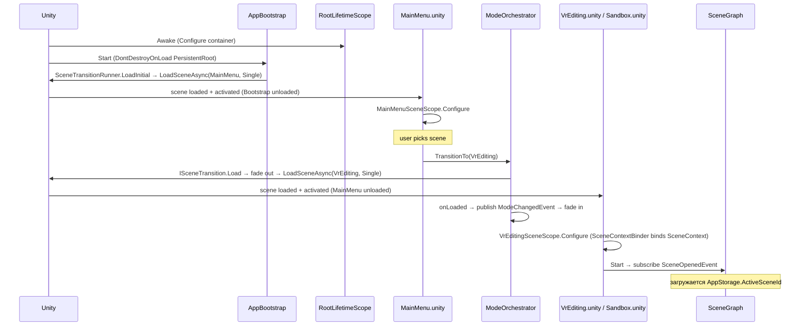
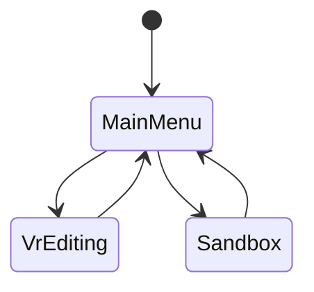
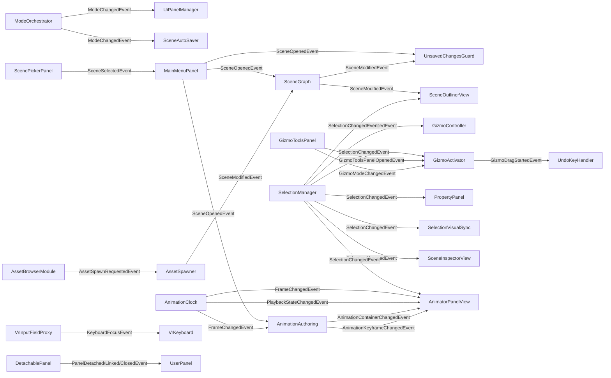

# PromeonLab Runtime Architecture

> Документ описывает реальное состояние кода под `Assets/_App/` на момент ветки `dev` (commit `cddb65e`).
> Где `CLAUDE.md` расходится с кодом — указано явно.

---

## 1. Startup Order

Точка входа — сцена `Assets/_App/Scenes/Bootstrap.unity`. Вся инфраструктура (`RootLifetimeScope`, XR-рига, EventSystem, `SceneTransitionRunner` + `HeadFade`) сгруппирована под единым корневым объектом `PersistentRoot`. Отдельно лежит `AppBootstrap` (`Assets/_App/Scripts/Bootstrap/AppBootstrap.cs`) — одноразовый, вне `PersistentRoot`. Никаких `FeatureLifetimeScope` в проекте нет.

Загрузка — **single-scene**: в любой момент загружена ровно одна mode-сцена, инфраструктура переживает переходы через `DontDestroyOnLoad(PersistentRoot)`.

Последовательность:

1. Unity грузит `Bootstrap.unity`. Awake'ятся объекты под `PersistentRoot` + `AppBootstrap`.
2. `RootLifetimeScope.Awake()` (VContainer) собирает корневой контейнер — см. секцию 2.
3. `AppBootstrap.Start()` блокирует курсор, делает `DontDestroyOnLoad(PersistentRoot)` и зовёт `SceneTransitionRunner.LoadInitial("MainMenu", …)` — стартует из полного чёрного и грузит `MainMenu` через `LoadSceneMode.Single`.
4. Single-загрузка автоматически делает `MainMenu` активной сценой и выгружает `Bootstrap` — остаётся только `PersistentRoot`. Затем `HeadFade` плавно открывает обзор.
5. `MainMenu.unity` несёт `MainMenuSceneScope` (наследуется от `RootLifetimeScope` через родительско-дочернюю связь сцен VContainer). Регистрирует `UnsavedChangesGuard`, `ScenePickerPanel`, `MainMenuPanel`.
6. Пользователь выбирает сцену в `ScenePickerPanel`/`MainMenuPanel` — публикуется `SceneSelectedEvent`, дальше `SceneOpenedEvent`.
7. `MainMenuPanel` (либо «Sandbox»-кнопка) дёргает `ModeOrchestrator.TransitionTo(VrEditing|Sandbox)`. Тот валидирует переход и делегирует `ISceneTransition` (`SceneTransitionRunner`): fade в чёрный → `LoadSceneAsync(target, Single)` → колбэк публикует `ModeChangedEvent` → fade из чёрного.
8. В новой сцене Awake'ится `VrEditingSceneScope` / `SandboxSceneScope` — Scoped-регистрации становятся доступны; `SceneContextBinder.Start()` биндит сценические сервисы в root-`SceneContext` и публикует `SceneContextChangedEvent`.
9. `SceneGraph.Start()` подписывается на `SceneOpenedEvent` и, если уже есть активный `AppStorage.ActiveSceneId`, асинхронно стартует загрузку графа.
10. `PlayerSpawnApplier` на XR Rig слушает `SceneManager.sceneLoaded` и телепортирует риг в `(0, 0, 0)`. `FallGuard` рестартит респаун, если `transform.y < -20`.



---

## 2. VContainer DI — Scope Hierarchy

> Note: CLAUDE.md описывает трёхуровневую иерархию `Root → Scene → Feature`. В коде есть только два уровня: `RootLifetimeScope` + один из сценических scope'ов. `FeatureLifetimeScope` нигде в `Assets/_App/` не реализован — упоминается только в `Assets/_App/Documentation/*.md`.

### 2.1 `RootLifetimeScope`

`Assets/_App/Bootstrap/RootLifetimeScope.cs`. Лежит на сцене `Bootstrap.unity`. Живёт до выхода из приложения.

| Тип | Lifetime | Откуда / Кому |
|---|---|---|
| `PathProvider` | Singleton | используется `AppStorage`, `AssetImporter`, экспорт |
| `AppStorage` | Singleton | `SceneGraph`, `MainMenuPanel`, `ScenePickerPanel`, `SceneAutoSaver` |
| `EventBus` | Singleton | публикуется по всему приложению |
| `AnimationClipboard` | Singleton | копи-паст ключей в `AnimationAuthoring` |
| `DemoAssetCatalog` | Instance (SO) | `AssetBrowserModule` |
| `ModeTransitionGraph` | Instance (SO) | `ModeOrchestrator` |
| `BuiltinAssetLibrary` | Instance (SO) | `AssetRegistry` |
| `ImportedAssetLibrary` | Singleton | `AssetRegistry` |
| `SavedAssetLibrary` | Singleton | `AssetRegistry` |
| `AssetRegistry` (as `IAssetRegistry`) | Singleton | `SceneGraph`, `AssetSpawner` |
| `ModeOrchestrator` | Singleton | `UserPanel`, `MainMenuPanel`, `ScenePickerPanel` |
| `UserPanel` (instance from scene) | Instance | inject в `Construct(ModeOrchestrator, EventBus)` |
| `AssetBrowserModule` (instance) | BuildCallback Inject | hover-injected при первой Configure |
| `PlayerSpawnApplier` (instance) | Instance | используется `FallGuard` |
| `VrKeyboard` (instance) | BuildCallback Inject | VR-клавиатура |

### 2.2 `VrEditingSceneScope`

`Assets/_App/Bootstrap/VrEditingSceneScope.cs`. Awake'ится при загрузке `VrEditing.unity`, диспозится при выгрузке сцены.

| Тип | Lifetime | Покупатели через `[Inject]` |
|---|---|---|
| `PanelRegistry` (SO) | Instance | `UiPanelManager` |
| `GizmoConfig` (SO, опционально) | Instance | `GizmoActivator` |
| `Camera.main` | Instance | `UiPanelManager` (для билборда) |
| `UiPanelManager` | Scoped (+`IStartable`) | — |
| `UnsavedChangesGuard` | Scoped | подписан на `SceneModifiedEvent`/`SceneOpenedEvent` |
| `SceneGraph` (as `ISceneGraph`) | Scoped (+`IStartable`) | `GizmoActivator`, `AssetSpawner`, `XRPromeonInteractable` (косвенно) |
| `SceneAutoSaver` | Scoped (+`IStartable`) | — |
| `SelectionManager` (as `ISelectionManager`) | Scoped (+`IStartable`) | `XRPromeonInteractable`, `GizmoController`, `GizmoActivator`, `PropertyPanel`, `SceneInspectorView`, `SceneOutlinerView`, `AnimatorPanelView` |
| `CommandStack` | Scoped | `GizmoController`, `UndoKeyHandler` |
| `GizmoController` | Scoped (+`IStartable`) | `XRPromeonInteractable`, `GizmoActivator` |
| `SelectionVisualSync` | Scoped (+`IStartable`) | — |
| `AssetImporter` | Scoped | `AssetBrowserModule` |
| `AnimationClock` | EntryPoint (Scoped, `ITickable`) | `AnimationAuthoring`, `AnimatorPanelView`, `AnimatorTransportView` |
| `AnimationAuthoring` | EntryPoint (Scoped) | `AnimatorPanelView`, `BoneInspectorPanel` |
| `AssetSpawner` | Scoped (+`IStartable`) | — |
| `RigRuntime` (hierarchy) | Instance, если найден | `BoneInspectorPanel`, `IkSetupWizard` |
| `IkSetupWizard` (hierarchy) | Instance | `BoneInspectorPanel` |
| `BoneInspectorPanel` (hierarchy) | Instance | — |
| `PropertyPanel` (hierarchy) | Instance | — |
| `WorldClickCatcher` / `UndoKeyHandler` / `SceneOutlinerView` / `SceneInspectorView` / `AssetBrowserModule` / `AnimatorPanelView` / `GizmoActivator` / `GizmoToolsPanel` | BuildCallback Inject | по месту |

### 2.3 `SandboxSceneScope`

`Assets/_App/Bootstrap/SandboxSceneScope.cs`. Awake'ится при `Sandbox.unity`. Тот же набор, что у `VrEditingSceneScope`, **за минусом** `UnsavedChangesGuard`, `SceneAutoSaver`, `AnimationClock`/`AnimationAuthoring`. Песочница — без сохранения и без таймлайна.

### 2.4 `MainMenuSceneScope`

`Assets/_App/Bootstrap/MainMenuSceneScope.cs`. Awake'ится при `MainMenu.unity`.

| Тип | Lifetime |
|---|---|
| `UnsavedChangesGuard` | Scoped |
| `ScenePickerPanel` | `RegisterComponentInHierarchy` |
| `MainMenuPanel` | `RegisterComponentInHierarchy` |

### 2.5 Жизненный цикл

`ModeOrchestrator.TransitionTo` делегирует загрузку `ISceneTransition` — это `LoadSceneAsync(новая сцена, Single)` за fade'ом. Старая сцена выгружается автоматически (single load). Сценические scope'ы диспозятся вместе со своими сценами; `RootLifetimeScope` (под `PersistentRoot`, `DontDestroyOnLoad`) живёт всё приложение.

---

## 3. Event Bus — MessagePipe

> Note: CLAUDE.md обещает MessagePipe per-scope. В коде MessagePipe отсутствует; вместо него `Assets/_App/_Shared/Events/EventBus.cs` — самописная синхронная шина `Dictionary<Type, List<object>>` с `Subscribe<T>/Unsubscribe<T>/Publish<T>` (`T : struct`). Регистрируется как Singleton в `RootLifetimeScope` — то есть **одна шина на всё приложение, без scope-фильтрации**.

Все события — `struct`, объявленные в `Assets/_App/_Shared/Events/`:

| Event | Поля | Publisher(s) | Subscriber(s) |
|---|---|---|---|
| `SceneOpenedEvent` | `SceneId` | `MainMenuPanel` | `SceneGraph`, `AnimationAuthoring`, `UnsavedChangesGuard` |
| `SceneModifiedEvent` | — | `SceneGraph.AddNode/RemoveNode/OnSceneOpenedAsync` | `UnsavedChangesGuard`, `SceneOutlinerView` |
| `SceneClosedEvent` | — | `SceneAutoSaver` | — (отслеживается только для аналитики) |
| `SceneSelectedEvent` | `SceneId`, `DisplayName` | `ScenePickerPanel` | `MainMenuPanel` |
| `AssetImportedEvent` | `AssetId` | (никем, объявлен) | — |
| `AssetSpawnRequestedEvent` | `Asset`, `Position`, `Rotation` | `AssetBrowserModule` | `AssetSpawner` |
| `SelectionChangedEvent` | `SelectedNodeId` | `SelectionManager.Select` | `GizmoController`, `GizmoActivator`, `PropertyPanel`, `SelectionVisualSync`, `SceneInspectorView`, `SceneOutlinerView`, `AnimatorPanelView` |
| `NodeRenamedEvent` | `NodeId`, `NewName` | (рефакторинг open) | `SceneOutlinerView` |
| `ModeChangedEvent` | `PreviousMode`, `CurrentMode` | `ModeOrchestrator.TransitionTo` | `UiPanelManager`, `SceneAutoSaver` |
| `FrameChangedEvent` | `Frame` | `AnimationClock` (`Tick`, `Stop`, `Seek`, `Configure`) | `AnimationAuthoring`, `AnimatorPanelView` |
| `PlaybackStateChangedEvent` | `IsPlaying`, `Frame` | `AnimationClock` | `AnimatorPanelView` |
| `ErrorOccurredEvent` | `Level`, `Message` | (никем, ErrorHandling — заглушка) | — |
| `KeyboardFocusEvent` | `Target` (TMP_InputField) | `VrInputFieldProxy` | `VrKeyboard` |
| `PanelDetachedEvent` | `EntryId` | `DetachablePanel` | `UserPanel` |
| `PanelLinkedEvent` | `EntryId` | `DetachablePanel` | `UserPanel` |
| `PanelClosedEvent` | `EntryId` | `DetachablePanel` | `UserPanel` |
| `AnimationContainerChangedEvent` | `OwnerNodeId`, `Change` | `AnimationAuthoring` (Add/Remove/Rename Action) | `AnimatorPanelView` |
| `AnimationKeyframeChangedEvent` | `NodeId`, `OwnerNodeId`, `Frame`, `Change` | `AnimationAuthoring.RecordKey/Remove/Move` | `AnimatorPanelView` |
| `BonesVisibilityChangedEvent` | `RigNodeId`, `Visible` | (RigRuntime/IkWizard) | `SceneOutlinerView` |
| `GizmoToolsPanelOpenedEvent` | — | `GizmoToolsPanel` | `GizmoActivator` |
| `GizmoToolsPanelClosedEvent` | — | `GizmoToolsPanel` | `GizmoActivator` |
| `GizmoModeChangedEvent` | `Mode` | `GizmoToolsPanel` | `GizmoActivator` |
| `GizmoDragStartedEvent` | `TargetNodeId` | `GizmoActivator` | `UndoKeyHandler`, `GizmoToolsPanel` |
| `GizmoDragEndedEvent` | `TargetNodeId` | `GizmoActivator` | `UndoKeyHandler`, `GizmoToolsPanel` |

Поскольку шина одна на root-scope, все события видны из всех сцен. Scope-видимость, описанная в CLAUDE.md, отсутствует.

---

## 4. Mode Orchestration

`ModeOrchestrator` (`Assets/_App/Scripts/ModeOrchestrator/ModeOrchestrator.cs`) — Plain C# класс, без MonoBehaviour. Регистрируется Singleton в root. Чистая политика: не трогает `SceneManager` напрямую, механику загрузки держит `ISceneTransition` (`SceneTransitionRunner`).

Состояние одно — `AppMode _current` (по умолчанию `MainMenu`). Запрос `TransitionTo(target)`:

1. Если `target == _current` — no-op.
2. Если `_transition.IsTransitioning` — no-op (re-entrancy-гард).
3. Спрашивает `ModeTransitionGraph.IsAllowed(_current, target)`. Если запрещено — `Debug.LogWarning` и выход.
4. Сохраняет prev, переписывает `_current = target`.
5. Зовёт `_transition.Load(SceneNameFor(target), onLoaded)`. Runner: fade в чёрный → `LoadSceneAsync(target, Single)` → `onLoaded` публикует `ModeChangedEvent` → fade из чёрного.

Маппинг режим → имя сцены захардкожен в `SceneNameFor`: `MainMenu`, `VrEditing`, `Sandbox`. `AppMode.Debug` (объявленный в `AppMode.cs`) даёт `null` — то есть **режим `Debug` определён как enum, но не запускается оркестратором**.

### `ModeTransitionGraph`

ScriptableObject `Assets/_App/Subsystems/ModeOrchestrator/Data/ModeTransitionGraph.cs`. Хранит `List<Transition> { From, To }`. Asset — `DefaultModeTransitionGraph.asset`. По умолчанию (захардкожено в инициализаторе списка):

```
MainMenu  → VrEditing
VrEditing → MainMenu
MainMenu  → Sandbox
Sandbox   → MainMenu
```

Diagram:



Прямого перехода `VrEditing ↔ Sandbox` нет — только через `MainMenu`. `Debug` (по CLAUDE.md — overlay-режим) в графе отсутствует.

При смене режима новая сцена несёт свой `*SceneScope`; его `Configure` создаёт `UiPanelManager`, который через `RefreshVisibility()` по `_registry.IsVisibleIn(panelId, currentMode)` показывает или скрывает каждый `SpatialPanel`. Так панели «переключаются» между режимами без явного pooling.

---

## 5. Input Pipeline

OpenXR + Unity Input System. Файл `Assets/InputSystem_Actions.inputactions` — единственный inputactions-asset проекта; используется через стандартный `Action`-Asset reference на XR-rig.

### `InputBindings` subsystem

`Assets/_App/Subsystems/InputBindings/InputBindings.cs` — **заглушка** (`public static class InputBindingsPlaceholder { }`). Описанный в CLAUDE.md context-switching (`Navigation` / `Ui` / `GizmoManipulation`) **в коде не реализован**. Контексты разруливаются по месту: `XRPromeonInteractable` сам читает `activateInput`/`selectInput` через `NearFarInteractor`, `UserPanelOpener` создаёт собственный `InputAction` в `Awake`.

### Кастомная модель взаимодействия

`Assets/_App/Subsystems/VrInteraction/XRPromeonInteractable.cs` — наследник `XRBaseInteractable`. Стандартный XRI select-flow выключен: `IsSelectableBy(...) => false`. Состояния:

- `Idle` — если ховер от `NearFarInteractor` и `IsPrimaryFor(...)` (только ближайший collider на ray-хите):
  - `activateInput.WasPerformedThisFrame()` → lock, `_state = TriggerPressed`, `_pressTime = Time.time`.
  - `selectInput.WasPerformedThisFrame()` и объект уже выбран → lock, `CapturePositionOffset`, `_state = GripMove`.
- `TriggerPressed` — если триггер отпущен внутри `_tapWindow` (`0.5s`) → `_selectionManager.Select(node.NodeId)` (tap = select). Если удержан дольше и объект selected → `CaptureRotationOffset`, `_state = TriggerRotate`.
- `TriggerRotate` — пока триггер удерживается, `ApplyRotate()` через `IDragStrategy`. На отпускании — `GizmoController.CommitTransform` (фиксирует в `CommandStack`).
- `GripMove` — пока grip удерживается, `ApplyMove()`. На отпускании — `CommitTransform`.

Итог:

| Жест | Действие |
|---|---|
| tap trigger (короткое нажатие) | Select |
| hold trigger (на selected объекте) | Rotate |
| hold grip (на selected объекте) | Move |

Сам гизмо берёт на себя precise-transform (см. секцию 6).

### Хоткеи

- **Ctrl+Z (клавиатура)** → `CommandStack.Undo` через `UndoKeyHandler.Update` (`Input.GetKey` legacy). Игнорится во время drag (`GizmoDragStartedEvent`/`GizmoDragEndedEvent`).
- **primaryButton (X на LeftHand / A на RightHand)** → toggle `UserPanel.gameObject.SetActive`. Реализация — `UserPanelOpener` с `_toggle.AddBinding("<XRController>{LeftHand|RightHand}/primaryButton")`. При открытии вызывается `_panel.ResetPosition()`.
- **Redo / Save / Cancel-drag** — не реализованы.

---

## 6. Selection, Gizmo, Undo

### `SelectionManager`

`Assets/_App/Subsystems/SceneComposition/SelectionManager.cs`. Реализует `ISelectionManager`. API:

```csharp
string SelectedNodeId { get; }
void   Select(string nodeId);   // null допустимо = снять выделение
```

Только single-select. `Select` no-op'ит, если id совпадает. Иначе пишет в поле и публикует `SelectionChangedEvent`. Никакого multi-select API в коде нет — он есть только в виде упоминания в `CLAUDE.md`.

### Gizmo

`Assets/_App/Subsystems/VrInteraction/`:

- `GizmoController` (Scoped, `IStartable`) — слушает `SelectionChangedEvent`, держит `SceneNode _target`. Снаружи дёргают `CommitTransform(transform, pos, rot, scl)` или `CommitMove(...)` — оборачивает в `TransformCommand` и кладёт в `CommandStack`.
- `GizmoActivator` (MonoBehaviour на сцене) — подписан на `SelectionChangedEvent` / `GizmoToolsPanel*Event` / `GizmoModeChangedEvent`. Спавнит/деспавнит instance гизмо (`GizmoConfig`-prefab); во время drag — гизмо primary source-of-truth (`instance.transform` мутируется стратегией, target подтягивается по `instance.scale / instanceAtGrab`).
- `GizmoHandle` — handle на гизмо; читает `selectInput` (grip) от `NearFarInteractor`. Запускает strategy → `GizmoDragStartedEvent`, в конце `GizmoDragEndedEvent`.
- `IDragStrategy` / `SingleDragStrategy` — применяют новое pos/rot к transform (по `DragMode.PositionOnly`/`RotationOnly`).
- `SelectionVisualSync` — слушает `SelectionChangedEvent`, переключает `Selectable` outline / `SelectionVisual`.

Виртуальная рука (rotation-input для гизмо) — handled внутри `GizmoHandle` через `NearFarInteractor.selectInput.ReadValue()`.

### `CommandStack`

`Assets/_App/Subsystems/SceneComposition/Data/CommandStack.cs`. Простой `LinkedList<ICommand>`, `_maxHistory = 30`. API:

```csharp
void Execute(ICommand command);   // Execute + push
void Undo();                      // pop last + Undo
```

**Redo не реализован.** Пользуется им: `GizmoController.CommitTransform` (через `TransformCommand`). Прямые мутации в обход стека — `SceneGraph.AddNode/RemoveNode` (тоже не undoable).

---

## 7. UI System

### `SpatialPanel`

`Assets/_App/Subsystems/SpatialUi/Scripts/Panels/SpatialPanel.cs`. Базовый класс для всех VR-панелей. `PanelType { BodyLocked, WorldFixed, Free }` (per inspector). Особенности:

- `BodyLocked` — `LateUpdate` зовёт `FollowCamera` (с опциональным `_lazyFollow`/`_lazyAngle`/`_lazySpeed`).
- `_billboard` — `FaceCamera` через `LookRotation(toCam)`.
- `Init(PanelId, Transform cameraTransform)` вызывается из `UiPanelManager.SpawnPanels`.
- `SetVisible(bool)` = `gameObject.SetActive`.

`ToolbarPanel` (упомянут в CLAUDE.md) в коде отдельно не объявлен — функционал toolbar'а распределён по `AnimatorToolbarView`, `AnimatorTransportView`, `GizmoToolsPanel`, и nav-bar внутри `UserPanel`.

### `UiPanelManager`

`Assets/_App/Subsystems/SpatialUi/Scripts/Panels/UiPanelManager.cs`. Scoped + `IStartable`. На `Start`:

1. Подписывается на `ModeChangedEvent`.
2. Идёт по `_registry.Panels` (`PanelRegistry` SO), для каждой записи: `_resolver.Instantiate(prefab)`, `panel.Init(id, cameraTransform)`, кэширует в `_panels`.
3. `RefreshVisibility()` — для каждой панели `panel.SetVisible(_registry.IsVisibleIn(id, currentMode))`.

То есть набор панелей фиксирован на момент scope'а, а переключение режимов лишь меняет видимость.

### `UserPanel`

`Assets/_App/Subsystems/SpatialUi/Scripts/Panels/UserPanel.cs`. Наследник `SpatialPanel`. Один и тот же prefab используется и в `VrEditing`, и в `Sandbox` (см. memory `feedback_sandbox_is_separate_mode.md` и `project_userpanel_session2.md`). Содержит:

- Nav-bar (`NavBarBinding[]` — button + панель), переключающий `DetachablePanel`'ы.
- Кнопки `MainMenu`, `Exit`.
- Smart-follow конфигурация: `_recenterAngle`, `_smoothTime`, `_min/preferred/maxDistance`, `_yOffset`, `_faceBelowOffset`.
- Lock-mode (`_locked` + кнопка `_lockButton`), фиксирует панель в мире.

Открывается toggle'ом X/A (`UserPanelOpener`), скрыт по умолчанию.

### `DetachablePanel`

Сабпанель, которая может быть «отстёгнута» из nav-bar в free-floating и вернуться обратно. Публикует `PanelDetachedEvent` / `PanelLinkedEvent` / `PanelClosedEvent`; `UserPanel` слушает.

---

## 8. Storage & Persistence

### `PathProvider`

`Assets/_App/Subsystems/StorageCore/PathProvider.cs`. Singleton, root = `Application.persistentDataPath`. Все пути строятся через него:

```
{persistentDataPath}/
├── scenes/{SceneId}/
│   ├── scene.json
│   ├── asset-catalog.json
│   ├── animation.json
│   ├── assets/...
│   └── export/
└── asset-library/
    ├── imported.json
    └── saved.json
```

Метод `AssetPath(sceneId, relativePath)` — единственная точка склейки asset-путей. Прямое строковое склеивание путей в проекте не используется. Папок `Rigs/`, `Poses/`, описанных в CLAUDE.md, в коде нет — данные ригов держатся в составе `scene.json`/`animation.json`.

### Schema versioning

> Note: CLAUDE.md упоминает класс `StorageMigrator`. В коде такого класса нет. Миграция инлайнится в:

- `SceneSerializer.Deserialize` — поднимает `SceneData.SchemaVersion` с `<2` до `2`, инициализирует `Nodes ??= new()`. Логит warning.
- `AnimationAuthoring.LoadFor` (`AnimationAuthoring.cs:397+`) — если `loaded.schemaVersion < 2`, выбрасывает старые данные и стартует с нуля; если `> 2` — открывает пустой in-memory клон, исходный файл не трогает.

Текущие версии:

| Файл | Класс | Текущая `schemaVersion` |
|---|---|---|
| `scene.json` | `SceneData` | `2` |
| `animation.json` | `SceneAnimationData` | `2` |
| `asset-catalog.json` | `AssetCatalogData` | `1` |

### `AppStorage`

`Assets/_App/Subsystems/StorageCore/AppStorage.cs`. Кеш `Dictionary<string, SceneData>`. API:

- `CreateSceneAsync(displayName)` → новый `SceneId = Guid.NewGuid().ToString("N")[..8]`, создаёт папку, сохраняет.
- `LoadSceneAsync(sceneId)` — из кеша или из `scene.json`.
- `SaveSceneAsync(data)`.
- `GetAllSceneIds()` — перебор директорий в `scenes/`.
- `BeginSandboxSession()` — спецсцена с `SceneId = "__sandbox__"`, не сохраняется на диск.
- `SetActiveScene` / `ActiveSceneId`.

`SceneAutoSaver` слушает `ModeChangedEvent` и публикует `SceneClosedEvent` при выходе из сценического режима.

---

## 9. Subsystem Dependency Map

Все связи — через `EventBus`. Прямых cross-subsystem method-call'ов в коде не найдено, за двумя исключениями, которые проходят через `_Shared/Interfaces`:

- `XRPromeonInteractable` напрямую держит ссылки на `ISelectionManager` и `GizmoController` (через `[Inject]`). `GizmoController` тоже лежит в `VrInteraction` — это intra-subsystem. `ISelectionManager` — `_Shared/Interfaces`. Чисто.
- `GizmoController` напрямую вызывает `CommandStack.Execute` и `SceneGraph.GetNode` (через DI). `CommandStack` и `SceneGraph` живут в `SceneComposition`. Их конкретные типы регистрируются как `AsImplementedInterfaces().AsSelf()`, но `GizmoController` инжектит конкретные классы, не интерфейсы — формально это **нарушение** правила «контракты через `_Shared`», но `ICommand` существует, а отдельного `ICommandStack` — нет.



---

## 10. Known Issues / Current Quirks

- **IK interactable conflict.** Фабрика дублирует регистрацию коллайдеров для rig-ассетов, у которых есть nested `Interactable`'ы. `XRPromeonInteractable.Awake` уже делает `colliders.Clear()` и перезаливает по политике `_includeChildColliders` (см. inline-комментарий), но баг в фабрике пока остаётся открытым (`project_ik_interactable_conflict.md`).
- **Bone outline needs click.** Outline на «Show Bones» включается только после любого первого клика; на mesh работает сразу. Root cause не найден (`project_bone_outline_bug.md`).
- **QuickOutline patched.** В `Plugins/QuickOutline/.../LoadSmoothNormals` ручной guard на `mesh.isReadable`. Re-import пакета затрёт правку (`project_quickoutline_patched.md`).
- **Spawn simplified.** `PlayerSpawnAnchor` удалён. `PlayerSpawnApplier` на XR Rig слушает `SceneManager.sceneLoaded` и через `XRBodyTransformer.QueueTransformation` телепортит rig в `(0,0,0,identity)`. `FallGuard` (тот же GO) при `transform.y < -20` дёргает `Respawn()` (`project_spawn_simplified.md`).
- **`InputBindings`, `ExportPipeline`, `ErrorHandling`, `AnimationPlayback` — placeholder-файлы.** Реальной реализации в этих namespace'ах сейчас нет. `AnimationPlayback` явно помечен как «merged into `AnimationAuthoring` + `AnimationClock`».
- **`AppMode.Debug` не имеет сценического обработчика** в `ModeOrchestrator` — попытка `TransitionTo(Debug)` тихо не загрузит ничего.
- **MessagePipe отсутствует.** Все события идут через самописный `EventBus` — один глобальный, без scope-видимости.
- **Нет `FeatureLifetimeScope`.** Документация говорит о трёх уровнях DI, в коде — два (Root + Scene).
