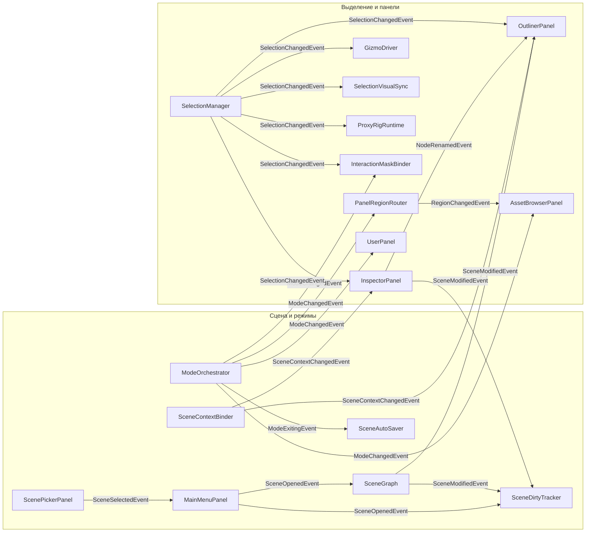
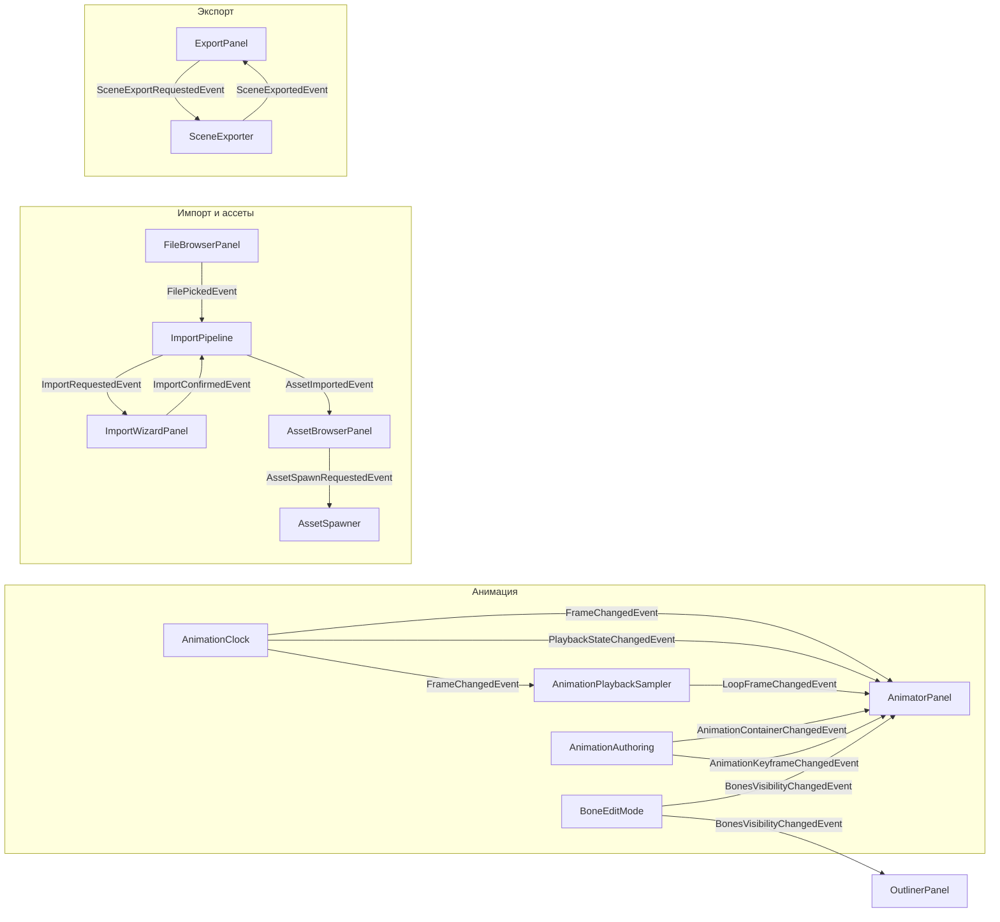

# Скрипты ВКР

> [!info] О базе
> Разбор скриптов диплома **PromeonLab** (Unity VR, C#) — все классы из текста раздела 3 и Приложения Б. Для каждого: назначение, построчный разбор неочевидных мест и блок **«К защите»** с вероятными вопросами комиссии. Структура повторяет «три обеспечения» раздела 3.

### Навигация по разделам

- ##### Разделы ВКР
    - [[3.1 Информационное обеспечение]] — данные, хранение, сериализация
    - [[3.2 Программное обеспечение]] — логика, интерфейс, анимация, экспорт
- ##### Сквозные подходы
    - [[Паттерн Publish-Subscribe]]
    - [[Внедрение зависимостей (VContainer)]]
    - [[Регионная модель UI]]
    - [[Прокси-риг]]
    - [[Прямой ввод вместо XRI]]
    - [[Дебаунс записи]]
    - [[Версионирование схем данных]]
- ##### События (Event-структуры)
    - [[Событийные структуры (Event)]] — как устроены и конструируются
    - [[События — сцена и режимы]]
    - [[События — анимация]]
    - [[События — ассеты и импорт]]
    - [[События — взаимодействие и гизмо]]
    - [[События — экспорт]]

___

### Карта потоков событий

> [!info] Кто кому шлёт
> Стрелка идёт от **издателя** к **подписчику**, подпись на стрелке — само событие. Физически все сообщения проходят через [[EventBus]] (издатель и получатель друг о друге не знают) — здесь показана логическая связь. Построено по реальным вызовам `Publish`/`Subscribe` в коде.

- ##### Сцена, режимы, выделение

- ##### Анимация, импорт, экспорт

___

### 3.1 Информационное обеспечение

- ##### Хранение и структуры данных
    - [[PathProvider]] · [[AppStorage]]
    - [[Структуры данных ассета]] · [[Структуры данных сцены]] · [[Структуры анимационных данных]]
- ##### Сериализация и сохранение
    - [[SceneSerializer]] · [[AnimationStorage]] · [[SceneDirtyTracker]] · [[SceneAutoSaver]]

___

### 3.2 Программное обеспечение

- ##### Архитектурный каркас
    - [[EventBus]] · [[RootLifetimeScope]] · [[SceneContext]] · [[SceneContextBinder]] · [[Области жизни сцен]]
    - [[ModeOrchestrator]] · [[SceneTransitionRunner]] · [[AppBootstrap]]
- ##### Пространственный интерфейс
    - [[SpatialPanel]] · [[PanelRegionRouter]] · [[RegionNavButton]] · [[RegionMember]]
    - [[UserPanel]] · [[PanelGrabHandle]] · [[VrInputFieldFocusBridge]]
- ##### Меню, сцены, граф
    - [[ScenePickerPanel]] · [[SceneListNode_Item]] · [[MainMenuPanel]]
    - [[SceneNode]] · [[SceneGraph]] · [[OutlinerPanel]]
- ##### Ассеты и импорт
    - [[AssetRegistry]] · [[AssetBrowserPanel]] · [[ThumbnailRenderer]]
    - [[ImportPipeline]] · [[ImportWizardPanel]] · [[BuiltinRecipeBaker]] · [[AssetSpawner]] · [[AssetEntityBuilderRegistry]]
- ##### Скелет
    - [[Структуры скелета]] · [[RigDefinitionExtractor]] · [[RigEntityFabricator]] · [[BoneFollower]] · [[ProxyRigRuntime]]
- ##### Взаимодействие
    - [[SelectionManager]] · [[SelectionVisualSync]] · [[Selectable]] · [[EmptySpaceClickDeselector]]
    - [[XRPromeonInteractable]] · [[GizmoDriver]] · [[GizmoDragSession]] · [[AxisMoveStrategy]] · [[InteractionMaskBinder]]
    - [[InspectorPanel]] · [[BoneEditMode]]
- ##### Анимация и экспорт
    - [[AnimatorPanel]] · [[AnimationAuthoring]] · [[AnimationClipBaker]] · [[AnimationClock]] · [[AnimationPlaybackSampler]]
    - [[ExportPanel]] · [[SceneBundle]] · [[SceneExporter]]

___

### Как пользоваться

- ##### Перед защитой
    - Идёшь по [[3.2 Программное обеспечение]] сверху вниз, на каждом скрипте читаешь блок **«К защите»** — это и есть тренировка ответов «по строчке».
- ##### События
    - Связь модулей и «конструкторы» сообщений — [[Событийные структуры (Event)]] и карта потоков выше.
- ##### Стандарт оформления
    - [[_STYLE]] — шаблон заметки (для будущих дополнений).
